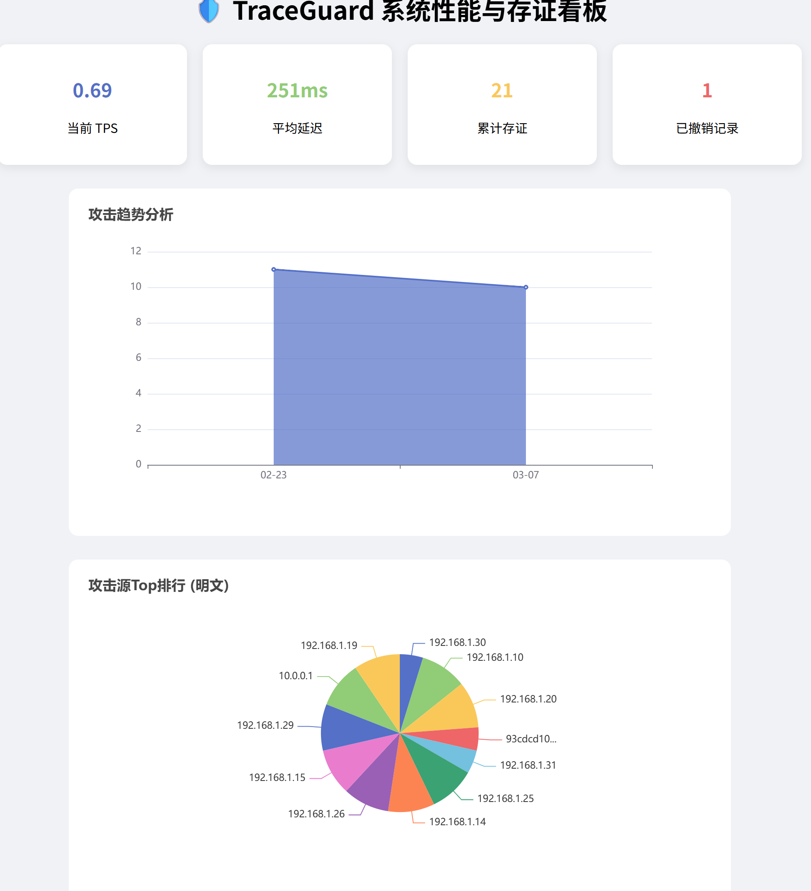
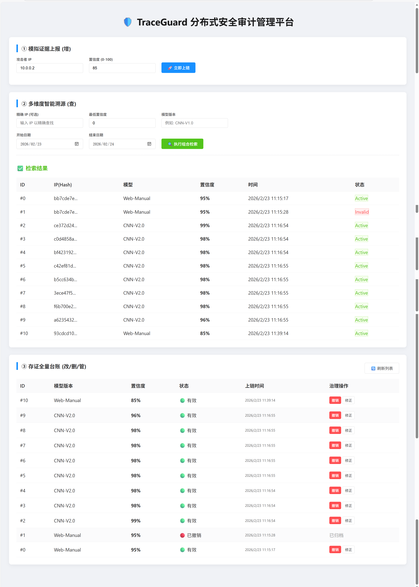

# 🛡️ Blockchain-assisted TraceGuard

> An intelligent, decentralized DDoS evidence auditing and governance system based on **Deep Learning (CNN)** and **Consortium Blockchain (FISCO BCOS)**.

  

## 📖 Introduction

**TraceGuard** solves the problem of trust and traceability in traditional DDoS defense. 
By combining a **1D-CNN deep learning model** for traffic detection with **Blockchain technology** for immutable storage, it ensures that every attack evidence is verifiable, traceable, and tamper-proof.

It includes a full-featured management terminal supporting **High-concurrency Uploads**, **Multi-dimensional Queries**, and **Data Governance**.

## ✨ Key Features

- **🧠 AI-Powered Detection**: Uses 1D-CNN trained on the CIC-DDoS2019 dataset to detect attacks with **94%+ accuracy**.
- **🔗 Immutable Evidence**: Attack features and IP hashes are stored on the Blockchain, ensuring data integrity.
- **⚡ High Performance**: Supports asynchronous concurrent uploading with a benchmarked throughput of **150+ TPS** (in single-node simulation).
- **📊 Visualization Dashboard**: Provides a real-time Web dashboard (ECharts) for traffic monitoring and statistical analysis.
- **⚖️ Data Governance**: Supports logical deletion (revoke) and confidence correction with full audit logs.
- **🔒 Privacy Protection**: Uses salted hashing for IP storage to protect privacy while allowing verification.

## 📂 Project Structure

```text
├── java_backend/          # Blockchain Interaction Layer (Java)
│   ├── src/               # Source code for Terminal & WebServer
│   ├── libs/              # Dependencies (FISCO BCOS SDK, etc.)
│   └── resources/         # Configuration & Certificates
│
├── python_detection/      # Detection Engine Layer (Python)
│   ├── models/            # Trained CNN models (.h5) & Scalers
│   ├── detect_service.py  # Real-time detection script
│   └── train_dl_model.py  # Model training script
```

## 🔒 Security & Credentials

For security reasons, **private keys and certificates are NOT included** in this public repository. 

To run the system, you need to:
1.  Generate your own certificates (`ca.crt`, `sdk.crt`, `sdk.key`) from your FISCO BCOS node.
2.  Export your account private key (e.g., `0x...pem`).
3.  Place these files into the following directory:  
    `java_backend/src/main/resources/conf/`

> **Note:** The addresses and keys used in my previous development were for a local test environment only and have been revoked.

## 🚀 Quick Start
Prerequisites
FISCO BCOS (4 nodes running)
JDK 11
Python 3.8+ (TensorFlow, Pandas, Scikit-learn)
### 1. Start the Blockchain Nodes
Ensure your FISCO BCOS nodes are running in your virtual machine:

```bash
bash nodes/127.0.0.1/stop_all.sh
rm -rf nodes/127.0.0.1/node*/data
rm -rf nodes/127.0.0.1/node*/log/*
bash nodes/127.0.0.1/start_all.sh
```
### 2. Run Detection Engine (Python)
The Python script detects DDoS attacks from the dataset and generates JSON evidence.

```bash
cd python_detection
python detect_service.py
```
*(Note: Select Option 1 in the menu to start batch detection.)*

### 3. Run Management Terminal (Java)
The Java terminal handles blockchain interactions.

1.  **Import Project**: Open the `java_backend` folder in **IntelliJ IDEA**.
2.  **Configuration**: Edit `src/main/resources/config.toml` and set `peers` to your VM's IP address.
3.  **Run**: Execute the `TraceGuardTerminal.java` class.

### 4. System Operations
Once the Java Terminal is running, you can use the following commands in the console:

*   `1`: **Monitor & Upload**  
    Listen for new evidence generated by Python and automatically upload it to the blockchain.
*   `2`: **Query**  
    Trace history by IP address or filter records by multi-dimensional conditions.
*   `3`: **Governance**  
    Administrator tools to revoke invalid evidence or update confidence scores.
*   `4`: **Count**  
    Return the height of the blockchain.
*   `5`: **Dashboard**  
    Generate a `dashboard.html` file for data visualization.
*   `tps 500`: **Benchmark**  
    Run a scientific stress test with 500 concurrent transactions to measure TPS.

### 5. Launch Web Management Dashboard
To enable the real-time web monitoring and governance interface:

1.  **Compile the Project** (On VM):
    Ensure the Java logic is up-to-date with the latest contract paths.
    ```bash
    cd ~/fisco/asset-app
    ./gradlew clean classes
    ```

2.  **Deploy New Contract**:
    This generates a fresh `contract.properties` file with the new address.
    ```bash
    java -cp "build/classes/java/main:build/resources/main:dist/lib/*" org.fisco.bcos.asset.client.DdosClient deploy
    ```

3.  **Start Web Server**:
    Run the backend service to host the monitoring page.
    ```bash
    java -cp "build/classes/java/main:build/resources/main:dist/lib/*" org.fisco.bcos.asset.client.TrafficWebServer
    ```

4.  **Access the Interface**:
    *   **Local (Inside VM)**: [http://localhost:9000](http://localhost:9000)
    *   **Remote (Windows Host)**: `http://<YOUR_VM_IP>:9000`

> **Note:** The web interface allows for real-time visualization of attack logs synced directly from the blockchain state.

## 📊 Dashboard Preview

### 1. Real-time Monitoring Dashboard

You can view the real-time attack analysis by opening `dashboard.html` generated by the system.



### 2. Multi-dimensional Traceability Terminal
The management terminal allows administrators to query blockchain evidence and perform data governance.



## 🛠️ Technology Stack

*   **Blockchain**: FISCO BCOS, Solidity
*   **AI Engine**: TensorFlow, Keras, Scikit-learn
*   **Backend**: Java (Native SDK), HttpServer
*   **Frontend**: HTML5, ECharts
*   **Data Source**: CIC-DDoS2019

## 📄 License

This project is licensed under the MIT License.


